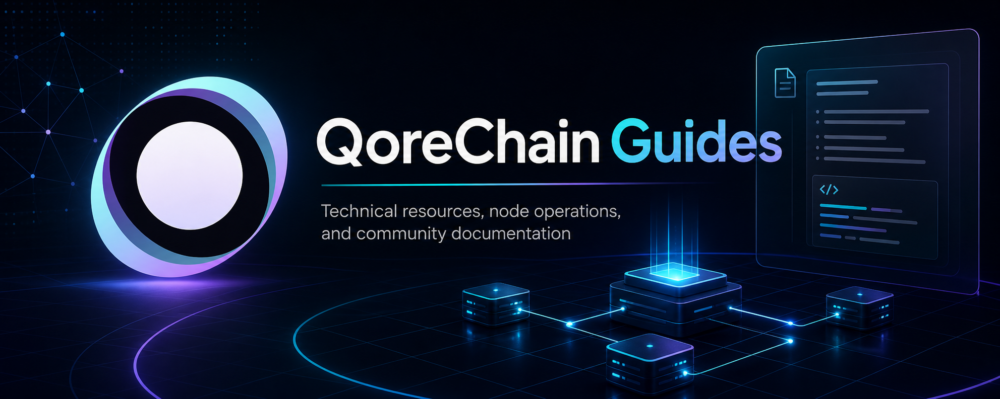

  

<h1 align="center">QoreChain Hub</h1>

  Turkce ve Ingilizce teknik kaynaklar, node operasyon notlari ve gorev surecleri. 
  Bilingual technical resources, node operation notes, and task workflows.

  
  
  

  <a href="./tr/README.md">Turkce Kaynaklar</a> -
  <a href="./en/README.md">English Resources</a> -
  <a href="./ROADMAP.md">Roadmap</a> -
  <a href="./CONTRIBUTING.md">Contributing</a> -
  <a href="./SUPPORT.md">Support</a> -
  <a href="./LICENSE.md">License</a>

---

QoreChain Hub, QoreChain ekosistemi icin hazirlanan topluluk odakli bir bilgi merkezidir. Amac; kurulum, kontrol, takip ve temel sorun giderme sureclerini tek bir yerde, sade ve uygulanabilir bir duzenle toplamaktir.

QoreChain Hub is a community-focused knowledge base for the QoreChain ecosystem. Its goal is to keep setup, verification, monitoring, and basic troubleshooting flows in one clear and practical place.

## Dil Secimi / Language

| Dil | Bolum | Durum |
|---|---|---|
| Turkce | [Turkce Kaynaklar](./tr/README.md) | Aktif |
| English | [English Resources](./en/README.md) | Active |

## Hizli Linkler / Quick Links

| Kaynak / Resource | Aciklama / Description |
|---|---|
| [Light Node Setup](./LIGHTNODE_SETUP.md) | Kisa iki dilli kurulum referansi / Short bilingual setup reference |
| [FAQ](./FAQ.md) | Sik sorulan sorular / Frequently asked questions |
| [English FAQ](./en/faq.md) / [Turkce SSS](./tr/sss.md) | Iki dilli topluluk SSS sayfalari / Bilingual community FAQ pages |
| [Glossary](./en/glossary.md) / [Terimler Sozlugu](./tr/terimler-sozlugu.md) | Temel QoreChain ve blokzincir kavramlari / Core QoreChain and blockchain terms |
| [Eigenstate 2 Tasks](./en/eigenstate-2-tasks.md) / [Eigenstate 2 Gorevleri](./tr/eigenstate-2-gorevleri.md) | Gorev kaniti ve manuel inceleme akisi / Task proof and manual review workflow |
| [Proof Link Guide](./en/proof-link-guide.md) / [Kanit Linki Rehberi](./tr/kanit-linki-rehberi.md) | SS yukleme alani olmadiginda kanit linki hazirlama / Preparing proof links when there is no screenshot upload field |
| [Roadmap](./ROADMAP.md) | Planlanan dokumantasyon basliklari / Planned documentation work |
| [Contributing](./CONTRIBUTING.md) | Katki rehberi / Contribution guide |
| [Style Guide](./STYLE_GUIDE.md) | Yazim ve format kurallari / Writing and formatting rules |
| [Support](./SUPPORT.md) | Destek ve geri bildirim akisi / Support and feedback flow |
| [Security](./SECURITY.md) | Guvenlik notlari / Security notes |
| [License](./LICENSE.md) | Lisans bilgisi / License information |

## Icerik Haritasi / Content Map

| Alan / Area | Turkce | English | Durum / Status |
|---|---|---|---|
| Light Node | [Light Node Operasyonlari](./tr/light-node-operasyonlari.md) | [Light Node Operations](./en/light-node-operations.md) | Aktif / Active |
| Bilgi Bankasi | [QoreChain Bilgi Bankasi](./tr/bilgi-bankasi.md) | [QoreChain Knowledge Base](./en/knowledge-base.md) | Aktif / Active |
| SSS / FAQ | [QoreChain SSS](./tr/sss.md) | [QoreChain FAQ](./en/faq.md) | Aktif / Active |
| Terimler | [Terimler Sozlugu](./tr/terimler-sozlugu.md) | [Glossary](./en/glossary.md) | Aktif / Active |
| Eigenstate 2 | [Eigenstate 2 Gorevleri](./tr/eigenstate-2-gorevleri.md) | [Eigenstate 2 Tasks](./en/eigenstate-2-tasks.md) | Aktif / Active |
| Kanit Linkleri / Proof Links | [Kanit Linki Rehberi](./tr/kanit-linki-rehberi.md) | [Proof Link Guide](./en/proof-link-guide.md) | Aktif / Active |
| Operator Rehberi | Operator El Kitabi | Operator Handbook | Planlandi / Planned |
| Sorun Giderme | Hata Cozumleri | Troubleshooting | Planlandi / Planned |

## Kimler Icin? / Who Is This For?

- QoreChain Light Node calistirmak isteyen operatorler
- Kurulum ve servis kontrol adimlarini takip etmek isteyen kullanicilar
- Sik sorulan sorulara hizli yanit arayan topluluk uyeleri
- Turkce ve Ingilizce kaynaklari ayni yapida tutmak isteyen katkicilar

- Operators who want to run a QoreChain Light Node
- Users who need setup and service-check steps
- Community members looking for quick answers to common questions
- Contributors who want to keep Turkish and English resources aligned

## QoreChain Hakkinda / About QoreChain

QoreChain, kuantum sonrasi guvenlik yaklasimini merkeze alan yeni nesil bir Katman 1 blokzincir altyapisidir. EVM uyumlulugu, CosmWasm destegi, SVM destegi, yapay zeka odakli altyapi ve aglar arasi dogrulayici mimarisi gibi basliklarla merkeziyetsiz altyapinin gelecek ihtiyaclarina odaklanir.

QoreChain is a next-generation Layer 1 blockchain infrastructure focused on post-quantum security, EVM compatibility, CosmWasm support, SVM support, AI-native infrastructure, and cross-network validator architecture.

## Belge Yaklasimi / Documentation Approach

Bu depodaki belgeler su ilkelere gore hazirlanir:

- Adimlar kisa, uygulanabilir ve kontrol edilebilir tutulur.
- Kritik islemlerde resmi kaynaklara ve guncel duyurulara yonlendirme yapilir.
- Turkce ve Ingilizce sayfalar mumkun oldugunca ayni yapida korunur.
- Komutlar, kontrol listeleri ve hata tablolarina oncelik verilir.

Documents in this repository follow these principles:

- Steps should stay short, practical, and verifiable.
- Critical actions should point users back to official sources and current announcements.
- Turkish and English pages should remain structurally aligned where possible.
- Commands, checklists, and troubleshooting tables are preferred over long explanations.

Daha ayrintili yazim ve format kurallari icin [Stil Rehberi](./STYLE_GUIDE.md) sayfasini kullanabilirsiniz.

For detailed writing and formatting rules, use the [Style Guide](./STYLE_GUIDE.md).

## Baglantili Projeler / Related Projects

- [QoreChain Light Node](https://github.com/satoshi-Qore/qorechain-lightnode)
- [QoreChain Araclari / Tools](https://github.com/satoshi-Qore/qorechain-tools)
- [QoreChain Notlari / Notes](https://github.com/satoshi-Qore/Qorechain-notes)
- [Satoshi-Qore GitHub Profili / Profile](https://github.com/satoshi-Qore)

## Katki ve Geri Bildirim / Contribution and Feedback

Eksik gordugunuz konular, yeni gorev notlari, kurulum iyilestirmeleri veya sorun cozumu onerileri icin issue acabilir ya da pull request gonderebilirsiniz.

You can open an issue or submit a pull request for missing topics, new task notes, setup improvements, or troubleshooting suggestions.

Planlanan dokumantasyon basliklari icin [Roadmap](./ROADMAP.md), katki duzeni icin [Contributing](./CONTRIBUTING.md) sayfasini inceleyebilirsiniz.

For planned documentation work, see the [Roadmap](./ROADMAP.md). For contribution guidance, see [Contributing](./CONTRIBUTING.md).

Destek ve guvenlik notlari icin [Support](./SUPPORT.md) ve [Security](./SECURITY.md) sayfalarini inceleyebilirsiniz.

For support and security notes, see [Support](./SUPPORT.md) and [Security](./SECURITY.md).

## Not / Disclaimer

Bu depo topluluk tarafindan hazirlanan bagimsiz bir bilgi merkezidir. Resmi QoreChain dokumantasyonu yerine gecmez; kritik adimlarda resmi kaynaklar ve guncel duyurular kontrol edilmelidir.

This is an independent community-maintained knowledge hub. It does not replace official QoreChain documentation; official sources and current announcements should be checked for critical steps.

QoreChain adlari, logolari ve ilgili markalar kendi sahiplerine aittir. Bu depo sponsorluk, onay veya resmi statu anlami tasimaz.

QoreChain names, logos, and related marks belong to their respective owners. This repository does not imply sponsorship, endorsement, or official status.

## Lisans / License

Dokumantasyon [CC BY 4.0](./LICENSE.md), kucuk kod ve komut ornekleri MIT License notu ile sunulur.

Documentation is provided under [CC BY 4.0](./LICENSE.md), with small code and command examples covered by the MIT License note.
